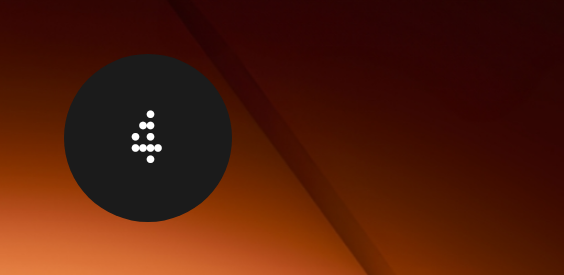

Nothing style 1x1 Ndot font date widget that launches Google calendar or Proton Calendar created using [KWGT Kustom Widget Maker.](https://play.google.com/store/apps/details?id=org.kustom.widget)

This is an unofficially designed widget not endorsed by Nothing®

## Features

*   1x1 112px canvas
*   Works with 4x4 and 5x5 app grid
*   Nothing Ndot font
*   \<1 battery usage
*   Refreshes at 00:00 local time

## Requirements

*   Compatible Android OS device
*   [KWGT Kustom Widget Maker](https://play.google.com/store/apps/details?id=org.kustom.widget) app

## Installation

*   Install [KWGT Kustom Widget Maker](https://play.google.com/store/apps/details?id=org.kustom.widget) app on your compatible Android device and follow the set up tutorial
*   Download the [Nothing-OS-style-1x1-date-widget.zip](https://github.com/wristtattoo/Nothing-OS-style-1x1-date-widget/archive/refs/heads/main.zip) from this repo
*   Extract to the internal device storage directory of your choice and unzip
*   Open the KWGT app on your device
*   Import .kwgt files from the directory you extracted them to

## To display the 1x1 date widget on your device

*   Press and hold an empty area on your home screen
*   Select Widgets
*   Select Kustom Widgets
*   Select KWGT 1x1 and drag to home screen
*   Click on the grey "Click to set up..." icon which opens the KWGT Kustom Widget Maker app
*   Select either Nothing 1x1 date widget for Google Calendar or Proton Calendar to run

## Screenshot

